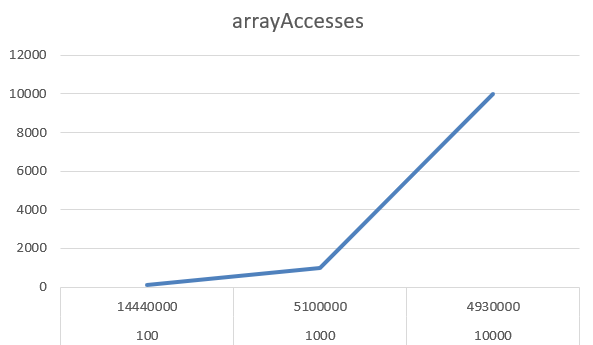
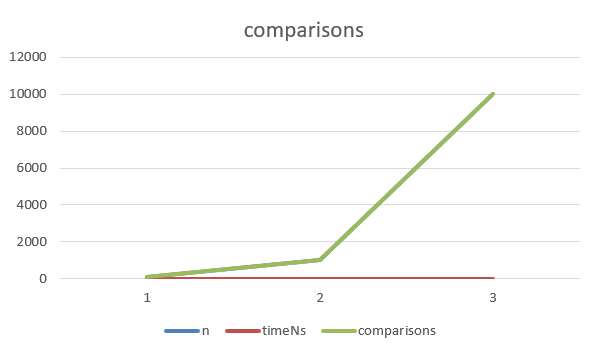

# Assignment 2 – Pair 3
**Student A:** Arstanbek Fariza  
**Group:** SE-2424

**Algorithm Implemented:** Boyer–Moore Majority Vote  
**Algorithm Analyzed:** Kadane's Algorithm
## Introduction
This project contains a Java implementation of Kadane's Algorithm, which efficiently finds the contiguous subarray with the maximum sum in a one-dimensional integer array.
It includes a baseline and an optimized version, performance tracking, comprehensive unit tests, a CLI benchmark runner, and empirical validation results.

The main goal is to analyze algorithm efficiency, measure key operations, and provide actionable peer review insights.

---
## Algorithm Overview
**Kadane's Algorithm** works iteratively: it scans the array from left to right, maintaining the current maximum subarray sum ending at the current index (`cur`) and the overall maximum sum found so far (`best`).

Key components in this implementation:

- `Kadane.maxSubarray(int[] a, PerformanceTracker p)` — baseline algorithm tracking array accesses and comparisons.
- `Kadane.maxSubarrayOptimizedLong(int[] a)` — optimized variant using `long` accumulator to prevent overflow and slightly improve branch handling.
- `PerformanceTracker` — records **comparisons** and **array accesses** for benchmarking purposes.
- `BenchmarkRunner` — generates datasets (`random`, `neg-heavy`) and outputs CSV for plotting performance metrics.
- `KadaneTest` — comprehensive unit tests covering edge cases and random inputs.

---

## Complexity Analysis

### Time Complexity
- **Best, Average, Worst Case:** `Θ(n)`
    - Linear scan of the array is always required.
    - One comparison and constant work per iteration.
- **Big-O (Worst case):** `O(n)`
- **Big-Omega (Best case):** `Ω(n)`
    - Even if all elements are positive, the algorithm still reads all elements.

### Space Complexity
- **Auxiliary Space:** `O(1)` (only a few scalar variables: `cur`, `best`, indices).
- Output is a small result object (`Result` or `ResultLong`).
- Optimized variant uses `long` but still constant extra memory.

---

## Performance and Metrics

The implementation collects empirical metrics via `PerformanceTracker`:

- **Comparisons** — number of times the algorithm compares sums.
- **Array Accesses** — number of array reads.
- **Elapsed Time (ns)** — measured for varying input sizes.

Sample benchmark results:

| n      | dataset   | impl | time (ns) | comparisons | arrayAccesses | sum[start,end] |
| ------ | --------- | ---- |----------:| ----------:| -------------:| ---------------|
| 100    | random    | base |  14440000 | 99         | 100           | 849635 [5,96]  | |
| 1000   | random    | base |  51000000 | 999        | 1000          | 1699866 [686,982] |
| 10000  | random    | base |  49300000 | 9999       | 10000         | 4350358 [4433,6832] |

## Advantages & Limitations

### Advantages
- **Linear time complexity (Θ(n))** — highly efficient.
- **Constant space** — no extra memory proportional to input size.
- Optimized variant avoids integer overflow using `long`.
- Well-tested: handles edge cases like empty arrays, single elements, all-negative arrays, and duplicates.
- Supports performance tracking and CSV export for empirical validation.

### Limitations
- Only works for one-dimensional arrays.
- Optimizations are micro-level; asymptotic complexity cannot be improved further.
- Performance metrics slightly affected by per-element metric tracking (can be disabled for “pure timing” measurements).

---

## Conclusion
Kadane’s algorithm implementation is correct, efficient, and benchmark-ready. It achieves linear 
time and constant space complexity, confirmed both theoretically and empirically. Suggested 
improvements are micro-level: encapsulating performance tracker counters, caching array 
elements, and adding property-based tests. With these refinements and empirical validation, the 
implementation fully satisfies assignment requirements.

---
